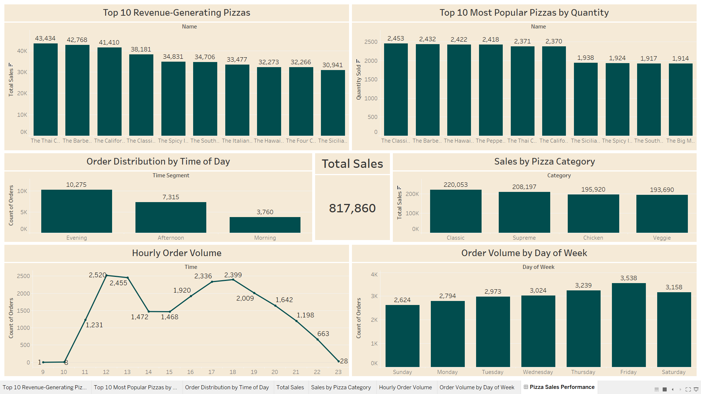
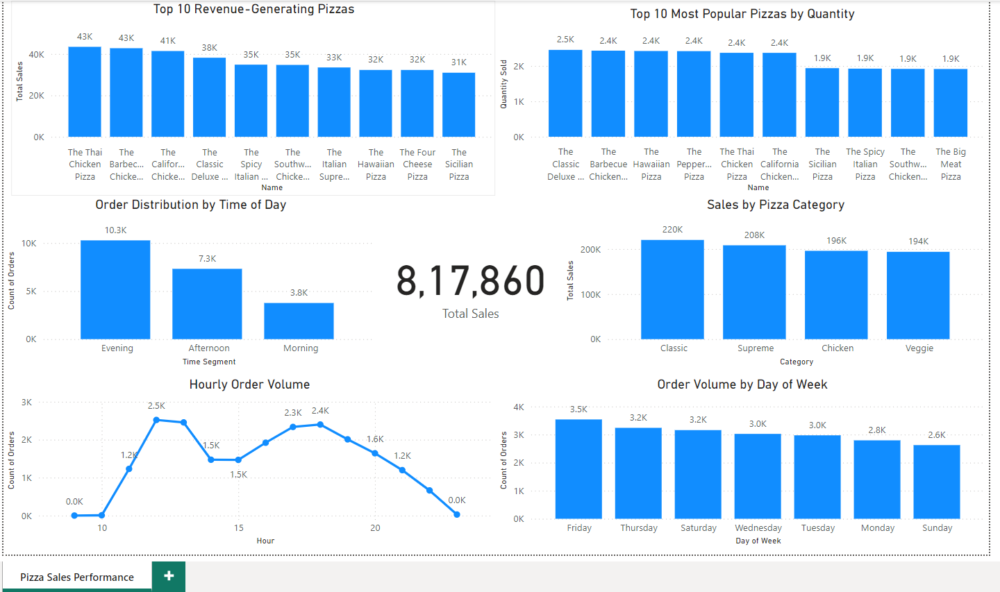

# Pizza Sales Analysis

This project analyzes pizza sales data to uncover key insights about revenue-generating pizzas, sales trends, and customer ordering behavior. The analysis was performed using Tableau and Power BI to create interactive visualizations and dashboards.

## Project Overview

The primary objective of this project is to analyze the sales data of a pizza store to identify trends, patterns, and areas for improvement. This analysis helps in understanding which pizzas are most popular, what times of the day are busiest, and which categories of pizzas contribute most to the revenue.

## Dataset

The dataset includes the following files:

- **pizzas.csv**: Contains pizza details, including `pizza_id`, `pizza_type_id`, `size`, and `price`.
- **pizza_types.csv**: Details about pizza types with columns `pizza_type_id`, `name`, `category`, and `ingredients`.
- **orders.csv**: Order information with `order_id`, `date`, and `time`.
- **order_details.csv**: Order details including `order_details_id`, `order_id`, `pizza_id`, and `quantity`.

## Dashboard Components
The dashboard consists of 6 charts and 1 KPI card:

1. **Top 10 Revenue-Generating Pizzas**
2. **Top 10 Most Popular Pizzas by Quantity**
3. **Order Distribution by Time of Day**
4. **Sales by Pizza Category**
5. **Hourly Order Volume**
6. **Order Volume by Day of Week**
7. **Total Sales KPI Card**

## Key Insights

1. **Revenue Leaders**: The Thai Chicken Pizza is the top revenue generator at $43,434, followed by the Barbecue Chicken Pizza at $42,768.

2. **Most Popular Pizzas**: The Classic Deluxe Pizza is the most ordered with 2,453 units sold, closely followed by the Barbecue Chicken Pizza at 2,432 units.

3. **Peak Order Times**: Evening hours see the highest order volume with 10,275 orders, compared to 7,315 in the afternoon and 3,760 in the morning.

4. **Category Performance**: Classic pizzas lead in sales with 220,053 units, followed by Supreme (208,197), Chicken (195,920), and Veggie (193,690) categories.

5. **Busiest Days**: Friday sees the highest order volume with 3,538 orders, while Sunday has the lowest at 2,624 orders.

6. **Hourly Trends**: Order volume peaks between 12-1 PM and 5-6 PM, with the highest at 2,520 orders.

7. **Total Sales**: The KPI card shows total sales of 817,860 units across all categories.

## Tools Used
- **Tableau**: Created an interactive dashboard for visualizing sales data and analyzing patterns.
- **Power BI**: Developed a detailed dashboard with key performance metrics and interactive elements.

## Visualizations

The project includes interactive dashboards created using Tableau and Power BI:

- **[Tableau Dashboard](visualizations/tableau/)**: Analyzes sales patterns with multiple interactive charts.
  - 

- **[Power BI Dashboard](visualizations/power_bi/)**: A Power BI dashboard providing insights on pizza sales performance.
  - 

## How to Explore This Project
1. **Tableau Dashboard**: 
   - Download the `.twbx` file from the `visualizations/tableau/` directory
   - Open with Tableau Desktop or view on [Tableau Public](https://public.tableau.com/views/PizzaSalesAnalysis_17256886191320/PizzaSalesPerformance?:language=en-GB&publish=yes&:sid=&:redirect=auth&:display_count=n&:origin=viz_share_link)

2. **Power BI Dashboard**: 
   - Download the `.pbix` file from the `visualizations/power_bi/` directory
   - Open with Power BI Desktop
